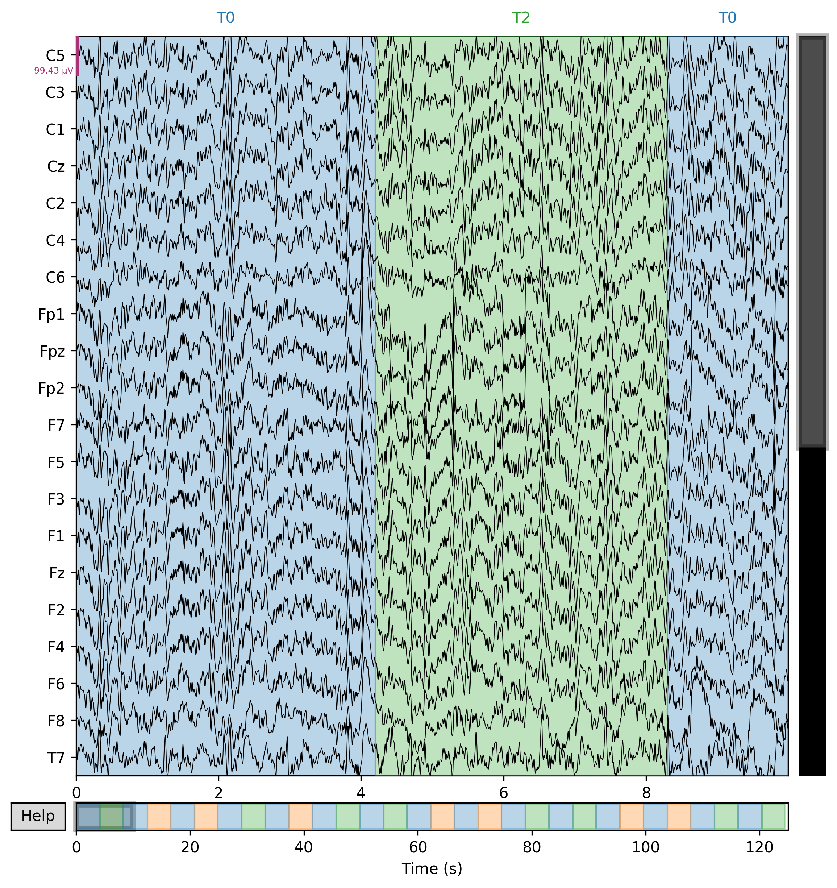
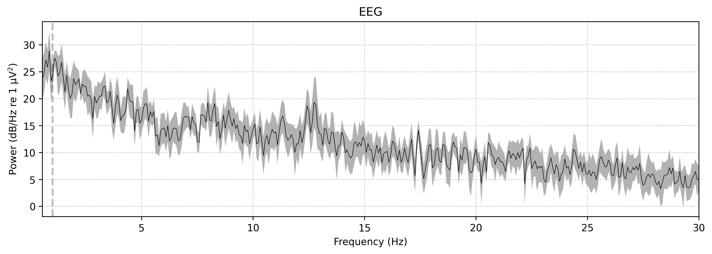
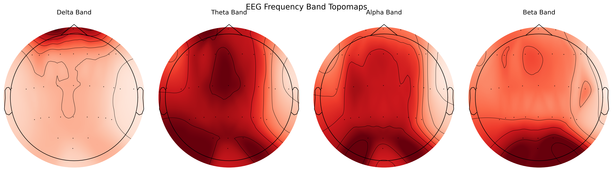
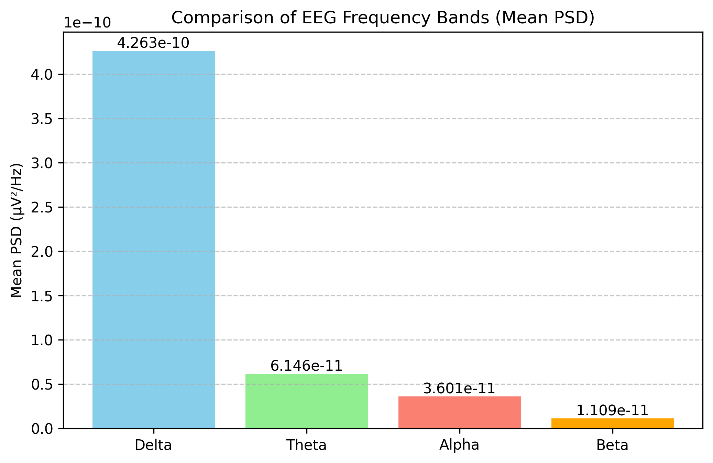

# EEG-Signal-Preprocessing and Frequency Domain Analysis

##  Project Overview
This project focuses on the analysis of EEG signals to study the distribution of brain activity across different frequency bands. The EEG data is processed to compute Power Spectral Density (PSD) and visualize band-specific brain activity using topographic maps and comparison plots.

The analysis is performed using Python and the MNE library.

---
##  Dataset Source
The EEG data used in this project was obtained from the EEG Motor Movement/Imagery Dataset available on PhysioNet. The dataset was accessed programmatically using the MNE-Python library through the `eegbci` module.

The EEGBCI dataset contains EEG recordings from healthy subjects performing motor execution and motor imagery tasks. The recordings were acquired using a 64-channel EEG system following the international 10–20 electrode placement standard.

Dataset Provider: PhysioNet  
Access Method: MNE-Python (`mne.datasets.eegbci`)  
Local Storage Path: `~/mne_data/`
---

##  Dataset Description
- **Data Type:** Electroencephalography (EEG)
- **Signal Type:** Continuous EEG recordings
- **Channels:** Standard EEG electrodes (e.g., 10–20 system)
- **Sampling Frequency:** As provided in the raw EEG files
- **File Format:** MNE-supported EEG format (e.g., .fif / .edf)

The dataset contains raw EEG signals recorded during experimental conditions and is preprocessed before analysis.

---

##  Preprocessing Steps
The following preprocessing steps are applied to the raw EEG data:

1. Band-pass filtering (0.5–30 Hz)
2. Removal of non-EEG channels
3. Selection of EEG channels only
4. Artifact-minimized signals used for PSD analysis

---

##  Frequency Bands Analyzed
The EEG signals are divided into standard frequency bands:

| Band  | Frequency Range (Hz) |
|------|----------------------|
| Delta | 0.5 – 4 |
| Theta | 4 – 8 |
| Alpha | 8 – 13 |
| Beta  | 13 – 30 |

---

##  Plots and Visualizations

### 1️ Raw EEG Signal Plot
Displays time-domain EEG signals used to visually inspect signal quality.

---

### 2️ Power Spectral Density (PSD) Plot
Shows the frequency-domain representation of EEG signals computed using Welch’s method.

---

### 3️ EEG Topographic Maps (Topomaps)
Illustrates the spatial distribution of EEG power across the scalp for each frequency band.

---

### 4️ Frequency Band Power Comparison (Bar Plot)
Compares average PSD values across different EEG frequency bands.

---

